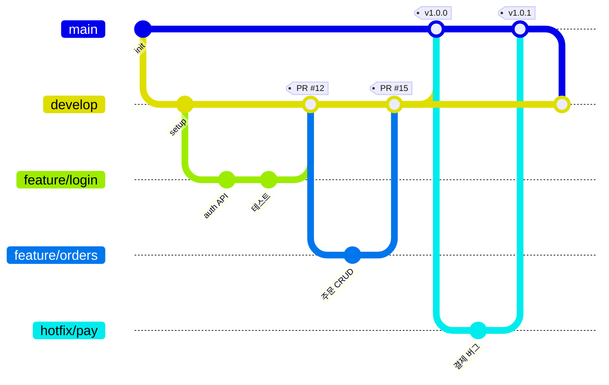

# gitGraph — 브랜치 전략

브랜치·머지·릴리즈 흐름을 그린다. 협업 규칙·릴리즈 프로세스 설명에 쓴다.

패턴: `main`=배포 가능 상태, `develop`=통합, `feature/*`=기능 단위, `hotfix/*`=긴급. 반드시 표기할 것: PR 번호·리뷰 게이트, 릴리즈 태그(SemVer), hotfix가 main과 develop 양쪽에 반영되는지. → PR 머지는 사람 게이트 [[AI-DEVELOPMENT-RULES]] B-8.
