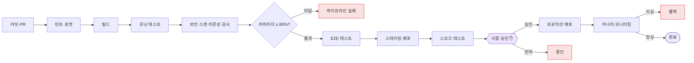

# CI/CD 파이프라인

커밋에서 배포까지의 자동화 단계와 게이트를 그린다.

```mermaid
flowchart LR
    DEV[커밋·PR] --> LINT[린트·포맷]
    LINT --> BUILD[빌드]
    BUILD --> UNIT[유닛 테스트]
    UNIT --> SEC[보안 스캔·의존성 감사]
    SEC --> COV{커버리지 ≥ 80%?}
    COV -->|미달| FAIL[파이프라인 실패]
    COV -->|통과| E2E[E2E 테스트]
    E2E --> STAGE[스테이징 배포]
    STAGE --> SMOKE[스모크 테스트]
    SMOKE --> GATE{{사람 승인 ✋}}
    GATE -->|승인| PROD[프로덕션 배포]
    GATE -->|반려| STOP[중단]
    PROD --> CANARY[카나리·모니터링]
    CANARY -->|이상| ROLLBACK[롤백]
    CANARY -->|정상| DONE([완료])

    classDef gate fill:#7C3AED22,stroke:#7C3AED;
    classDef err fill:#DC262622,stroke:#DC2626;
    class GATE gate;
    class FAIL,STOP,ROLLBACK err;
```

반드시 표기할 것: 실패 시 중단되는 게이트(커버리지·보안), **프로덕션 배포 전 사람 승인(✋)**, 카나리·롤백 경로. → 배포 승인은 사람 게이트 [[AI-DEVELOPMENT-RULES]] B-8, 커버리지 기준 [[테스트 전략 실전]].
