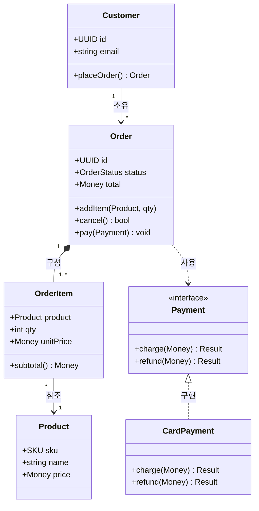

# 클래스 / 도메인 모델

도메인 객체·속성·관계·행위를 그린다. 도메인 경계 설계·리팩터 설명에 쓴다.

관계: `*--`=합성(생명주기 종속), `-->`=연관, `<|..`=인터페이스 구현, `..>`=의존. 반드시 표기할 것: 애그리게잇 루트(Order), 값 객체(Money·SKU), 인터페이스 경계, 불변식이 걸리는 메서드. → 도메인 경계 [[도메인 경계 설계]].
