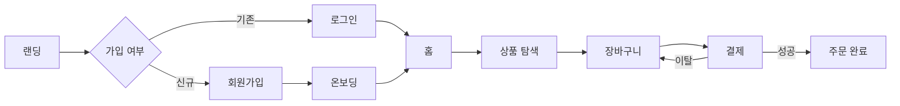
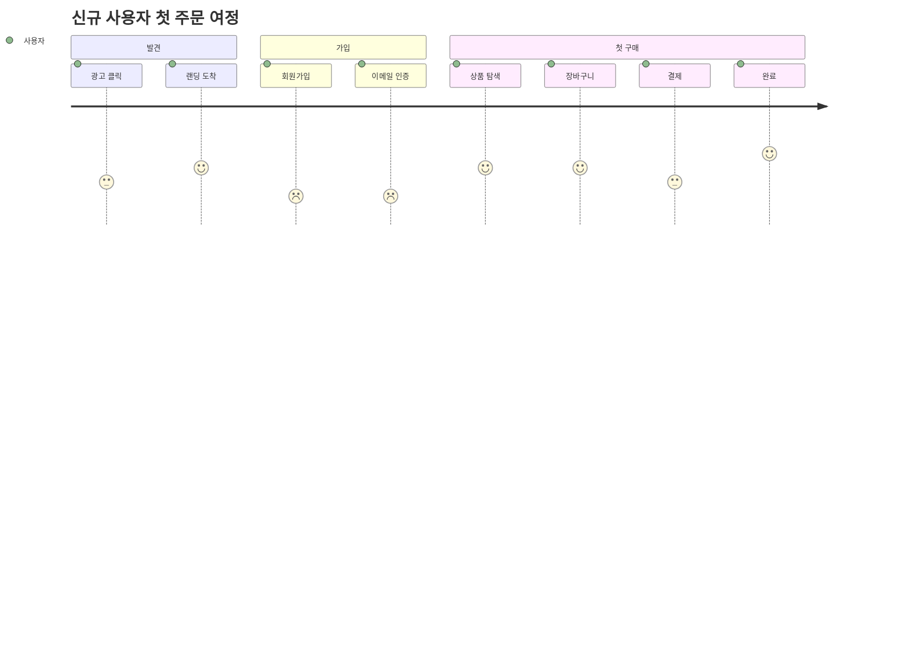

# 유저 플로우 · 여정

사용자가 화면·단계를 거치는 경로를 그린다. 기획·화면 설계·전환 지점 설명에 쓴다.

## 화면 전이형 (flowchart)

## 감정 여정형 (journey — 만족도 1~5)

반드시 표기할 것: 이탈 지점, 분기 조건, 마찰이 큰 단계(journey의 낮은 점수 = 개선 우선순위). → UX 원리 [[UX 원리]].
