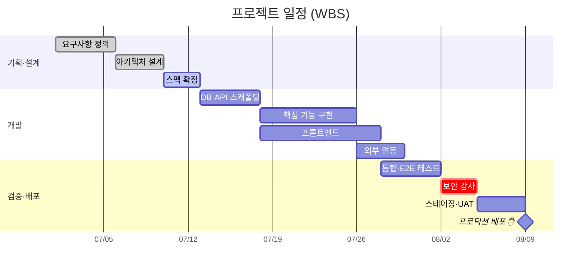

# Gantt — WBS · 일정

작업 분해와 일정·의존을 그린다. 계획 발표·진척 보고에 쓴다.

표기: `done`=완료, `active`=진행, `crit`=임계경로, `milestone`=이정표. 반드시 표기할 것: 작업 의존(`after`), 임계 경로(crit), 배포 이정표(사람 승인). 일정은 추정이지 약속이 아님을 밝힐 것. → 우선순위·스코프 [[우선순위와 스코프]].
